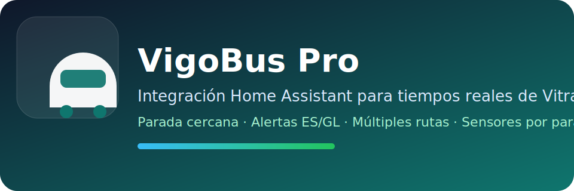

# VigoBus Pro

Custom integration for Home Assistant that exposes Vigo urban bus arrival times from Vitrasa, nearest stop support, extra stops, and line alerts.

## Features

- Nearest stop sensor based on your home location
- Additional configurable stops
- Arrival estimates with line, route, minutes, and bus distance
- Line alerts in Spanish and Galician with fallback
- Support for multiple route variants on the same line
- Local brand images included (`custom_components/vigobus/brand`) for Home Assistant 2026.3+
- Lovelace card support through the companion dashboard card repo

## Installation with HACS

1. Open HACS.
2. Add a custom repository.
3. Use the repository URL for this integration.
4. Select the category `Integration`.
5. Install `VigoBus Pro` and restart Home Assistant.

Repository URL: `https://github.com/MUbeira0/vigobus-integration`

## Configuration

Add the integration from Home Assistant UI:

- Settings
- Devices & Services
- Add Integration
- Search for `VigoBus Pro`

## Supported data

- Real-time ETA for Vigo urban bus stops
- Line and route information for each next arrival
- Remaining bus distance (when available)
- Service alerts per line (Spanish and Galician, with fallback)

## Troubleshooting

- If entities do not appear after install, restart Home Assistant.
- If icon/logo does not refresh, clear frontend cache and reload.
- If stop IDs changed upstream, open an issue with the affected stop and line.

## Support

- Documentation: https://github.com/MUbeira0/vigobus-integration
- Issues: https://github.com/MUbeira0/vigobus-integration/issues
- Releases: https://github.com/MUbeira0/vigobus-integration/releases

## Entities

The integration creates sensors for each configured stop:

- Main stop sensor
- Line sensor
- Route sensor
- Upcoming buses sensor

## Companion card

The dashboard card is intended to be published as a separate HACS Dashboard repository.
