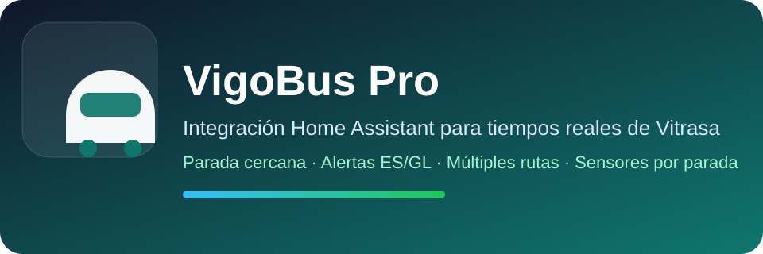

# VigoBus Pro



Custom integration for Home Assistant that exposes Vigo urban bus arrival times from Vitrasa, nearest stop support, extra stops, and line alerts.

[](https://github.com/MUbeira0/vigobus-integration/releases)
[](https://www.home-assistant.io/)
[](https://hacs.xyz/)

## Features

- Nearest stop sensor based on your home location
- Per-device nearest stop sensors: pick `person`/`device_tracker` entities in the config menu, or auto-create one for every GPS device (home stop is kept, never removed). Each of these sensors exposes an `is_device_nearest` attribute so dashboards (like the companion card) can reliably tell them apart from the home stop or a manually configured extra stop
- Every stop (home, extra, or per-device) is grouped as its own Home Assistant device, bundling its 4 sensors (state, line, route, upcoming) together in Settings → Devices & Services instead of a flat sensor list. Existing installs pick this up automatically on the next restart — no reconfiguration needed. A stop's device can be deleted from that page like any other device; if it's still configured (home nearest, an extra stop, a tracked person) it comes back automatically on the next reload, and if you removed it from the config it stays gone
- Additional configurable stops
- Arrival estimates with line, route, minutes, and bus distance
- Optional line filter per stop (nearest or extra) so a sensor only reports arrivals for one bus line
- Each upcoming bus is tagged with Vitrasa's own official line color (from their public line-geometry data), exposed as a `color` field per bus so dashboards can match the real livery instead of guessing
- Line alerts in Spanish and Galician with fallback
- Support for multiple route variants on the same line
- Local brand images included (`custom_components/vigobus/brand`) for Home Assistant 2026.3+
- Lovelace card support through the companion dashboard card repo
- Stop list, line colors, and alerts are cached in memory (not re-downloaded on every scan cycle) and independent devices/stops are refreshed concurrently, so scans stay fast even with several tracked people or configured stops
- Backs off automatically after repeated failures instead of retrying at full speed against a backend that's down, and resets to the configured interval as soon as it recovers
- Diagnostics support: Settings → Devices & Services → VigoBus Pro → Download diagnostics gives a redacted snapshot of coordinator/config state for bug reports, without needing to paste coordinates or custom stop names
- Optional "Notify when a new alert appears" toggle, with an optional list of notify services/devices to also send it to (in addition to the Home Assistant notifications panel)
- Trip planner: `vigobus.search_stops` and `vigobus.plan_trip` services plan a real bus trip (with transfers) from an origin to a destination using Vigo's official static GTFS schedule for Vitrasa — the companion card's "Plan a trip" section (its own on/off toggle) is built on these. Known limitations: destination must be a stop (no free-text address); only the itinerary's first bus leg is cross-checked against live arrival data; a query very late at night may miss a trip that started the previous service day

## Installation with HACS

1. Open HACS.
2. Add a custom repository.
3. Use the repository URL for this integration.
4. Select the category `Integration`.
5. Install `VigoBus Pro` and restart Home Assistant.

Repository URL: `https://github.com/MUbeira0/vigobus-integration`

## Configuration

Add the integration from Home Assistant UI:

- Settings
- Devices & Services
- Add Integration
- Search for `VigoBus Pro`

First-time setup only asks what's needed for the home nearest-stop sensor —
extra stops are added afterwards from **Configure**, which has a guided
search-and-pick UI (and a paste-a-list option for anyone who already knows
their stop IDs). **Configure** is also split into three focused sections
instead of one long form: Location & nearest stop, Notifications, and
Alerts.

## Supported data

- Real-time ETA for Vigo urban bus stops
- Line and route information for each next arrival
- Remaining bus distance (when available)
- Service alerts per line (Spanish and Galician, with fallback)

## Troubleshooting

- If entities do not appear after install, restart Home Assistant.
- If icon/logo does not refresh, clear frontend cache and reload.
- If stop IDs changed upstream, open an issue with the affected stop and line.

## Support

- Documentation: https://github.com/MUbeira0/vigobus-integration
- Issues: https://github.com/MUbeira0/vigobus-integration/issues
- Releases: https://github.com/MUbeira0/vigobus-integration/releases

## Entities

The integration creates sensors for each configured stop:

- Main stop sensor
- Line sensor
- Route sensor
- Upcoming buses sensor

## Companion card

The dashboard card is intended to be published as a separate HACS Dashboard repository.

## `vigobus.nearest_stops` service

Stateless lookup used by the companion card's "my location" mode: given a
latitude/longitude it returns the closest stop(s) with their upcoming buses.
It does not read or store any device tracker — callers (typically a
dashboard card reading the viewing device's own live geolocation) pass
coordinates on every call, so the result reflects whoever is looking at the
dashboard at that moment rather than a fixed home or tracker location. When
more than one stop is within `tie_margin_m` (default 60m) of the closest
one, several candidates are returned instead of just one.

```yaml
service: vigobus.nearest_stops
data:
  latitude: 42.2328
  longitude: -8.7226
```
